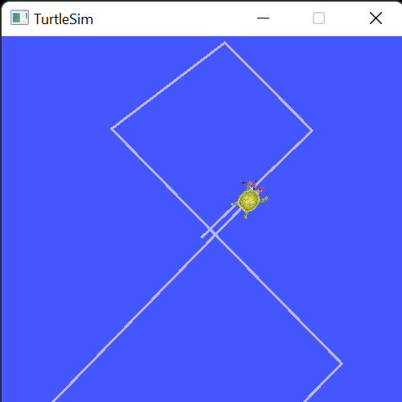

# Lab 2: ROS Setup and Tutorials

The goal of this lab is to configure your ROS 2 environment, and to explore basic ROS functionality.  It is intended as a low-effort lab which you can mostly finish during the lab session.  It will be due in one week at the same time as lab 1.  

# ROS 2 Install

We will use the Remote Desktop with ROS 2 pre-installed as described in [AV-22/Installation](https://gitlab.msu.edu/av/av-22/-/blob/main/Setup/Installation.md#egr-remote-desktop).  Use your web browser to open this remote desktop interface.  If you are on the campus network, you can use the RDP file with Windows Remote Desktop for a nicer interface.

# Configuring ROS 2

Follow the instructions in [AV-22/Shell_Config](https://gitlab.msu.edu/av/av-22/-/blob/main/Setup/Shell_Config.md) to configure your ROS environment.  You'll only need to configure PowerShell, not Ubuntu.  Then make sure to test your ROS environment with the publisher and subscriber example at the bottom of this page.  

# ROS Client Tools Tutorials

Next do nine of the [Beginner CLI Tools](https://docs.ros.org/en/humble/Tutorials/Beginner-CLI-Tools.html) tutorials; all except the first tutorial "Configuring environment", as you just configured your ROS environment.  

While it is possible to copy and paste the ROS commands, do not do this.  Instead, **type out each ROS command** in your terminal.  That will do much more to make you comfortable working with ROS, than pasting commands.  

# Submission

Do the following submission after you have completed all nine tutorials.  Make sure you have cloned your `<student_repo>` onto your M drive, as described in the [labs_22/Readme.md](https://gitlab.msu.edu/labs/labs_22/-/blob/main/README.md).

Create a folder inside your `<student_repo>` called `lab2_tutorials` and do the following steps: 
1. Start a fresh `turtlesim_node` simulation
2. Start recording a rosbag called `figure_eight.bag` that records only the topic `/turtle1/cmd_vel`. 
3. Navigate the turtle around in a rough figure eight shape using teleoperation 
4. Close the rosbag  
5. Make a screen capture of the turtle window called `figure_eight.png` which should look approximately like this:



6. Restart your `turtlesim_node` 
7. Play the rosbag you just recorded.  
8. When it is done, make a screen capture of the replayed turtle path called `figure_eight_replay.png`.

Note: to do a screen capture of a window, press `Windows-Alt-Print Screen`.  This will save the current window as an image to your `Documents\Videos\Captures` folder.  Alternatively, you can use `Windows-Shift-S` to capture a window or region, and then save it.

## What to submit:
- `figure_eight.bag`: the rosbag you recorded.  Normally one would not add a rosbag to a git repo as they are usually huge, but here the rosbag will be quite small so in this case it is okay to add the rosbag.
- `figure_eight.png`: the screen capture of the first figure eight run
- `figure_eight_replay.png`: the screen capture of a replay of the rosbag controlling the turtle.

When these 3 files are inside your `lab2_tutorials` folder, submit it as follows:
```
cd <student_repo>\lab2_tutorials
git add .
git commit -m "Add a comment here"
git push
```
Do not forget to `push`, or your lab will not be submitted.

# Due Date:

This lab is due **3pm EDT Thursday September 15th, 2022**.  This is the same time as lab 1 is due. Note this is probably the easiest lab and so a good way to accumulate points.
